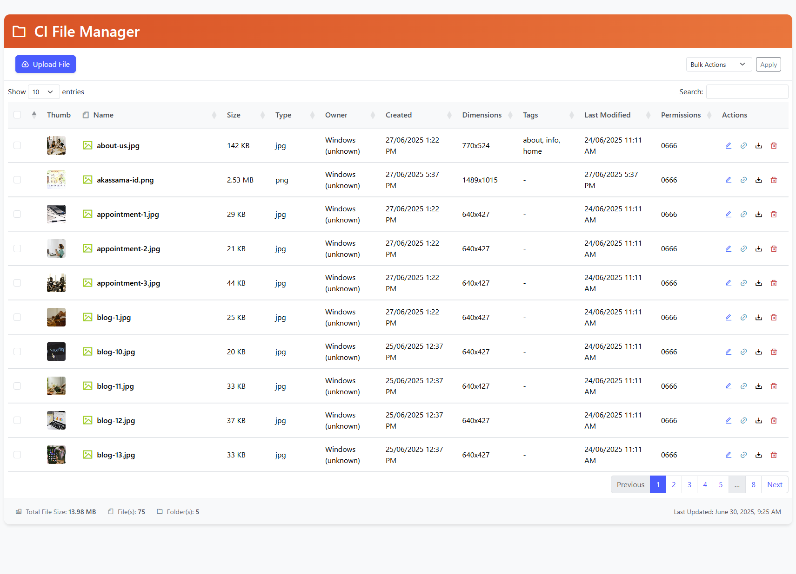

# CodeIgniter 4 File Manager

A lightweight, secure, and feature-rich file manager built for CodeIgniter 4, designed to manage files and folders with ease. It includes file upload, rename, delete, bulk delete, and a tagging system for organizing files. The file manager can be embedded in a fullscreen modal with a preloader for a seamless user experience.
Features

- File Management: Upload, rename, delete, and download files.
- Tagging System: Add and manage comma-separated tags for files, stored in a JSON metadata file.
- Bulk Actions: Select multiple files for deletion.
- Responsive Design: Built with Bootstrap 5 for a mobile-friendly interface.
- Preview Thumbnails: Displays thumbnails for images and placeholders for other file types.
- Security: Path validation, CORS checks, and secret key authentication.
- Embedded Modal: Integrate the file manager in a fullscreen modal with a preloader.
- DataTables Integration: Searchable and sortable file list with pagination.
- Customizable: Configurable via .env for upload limits, allowed file types, and styling.

<!-- PROJECT SCREENSHOT -->
<br />
<div align="center">
  <a href="https://github.com/akassama/codeigniter-file-manager">
    
  </a>
</div>

## Prerequisites

PHP 7.4 or higher
CodeIgniter 4.x
Composer
Web server (e.g., Apache, Nginx)
Write permissions for the upload directory and metadata file

## Installation

Clone or Download the Repository

```bash
git clone https://github.com/your-username/codeigniter-file-manager.git
cd codeigniter-file-manager
```

## Install Dependencies

Ensure Composer is installed, then run:

```bash
composer install
```

## Set Up Environment Configuration

Copy the .env.example to .env and configure the necessary settings:

```bash
CI_FM_FILES_UPLOAD_PATH="uploads/files"
CI_FM_ROUTE="ci-file-manager"
CI_FM_SECRET="your-secret-key"
CI_FM_METADATA_FILE="uploads/files/file_metadata.json"
CI_FM_MAX_UPLOAD_SIZE=10485760 # 10MB in bytes
CI_FM_ALLOWED_UPLOAD_TYPES="jpg,jpeg,png,gif,webp,pdf,doc,docx,xls,xlsx,zip,rar,txt"
CI_FM_PRIMARY_COLOR="#ef4322"
CI_FM_SECONDARY_COLOR="#ff6b3b"
CI_FM_LAST_MODIFIED_DATE_FORMAT="F j, Y, g:i A"
CI_FM_LAST_UPDATED_DATE_FORMAT="F j, Y, g:i A"
```

- CI_FM_FILES_UPLOAD_PATH: Directory for uploaded files (relative to project root).

- CI_FM_ROUTE: URL route for the file manager.

- CI_FM_SECRET: Secret key for secure AJAX requests.

- CI_FM_METADATA_FILE: Path to the JSON file storing tags.

- CI_FM_MAX_UPLOAD_SIZE: Maximum file size in bytes.

- CI_FM_ALLOWED_UPLOAD_TYPES: Comma-separated list of allowed file extensions.

- CI_FM_PRIMARY_COLOR and CI_FM_SECONDARY_COLOR: Customize the header gradient.

- Date formats for last modified and updated timestamps.

## Set Up File Permissions

Ensure the upload directory and metadata file are writable:

```bash
mkdir -p public/uploads
chmod -R 775 public/uploads
touch writable/file_metadata.json
chmod 664 writable/file_metadata.json
```

## Add Routes

Open app/Config/Routes.php and add the following route:

```bash
$routes->group('ci-file-manager', function ($routes) {
    $routes->get('/', 'FileManagerController::index');
    $routes->post('renameFile', 'FileManagerController::renameFile');
    $routes->post('deleteFile', 'FileManagerController::deleteFile');
    $routes->post('uploadFiles', 'FileManagerController::uploadFiles');
    $routes->post('bulkDelete', 'FileManagerController::bulkDelete');
});
```

## Embed the File Manager (Optional)

To embed the file manager in a modal, include the following in your view file:

```html
<!-- File Manager Modal -->
<div class="modal fade" id="ciFileManagerModal">
  <div class="modal-dialog modal-fullscreen">
    <div class="modal-content">
      <!-- Modal Header -->
      <div class="modal-header">
        <button
          type="button"
          class="btn-close"
          data-bs-dismiss="modal"
        ></button>
      </div>
      <!-- Modal body -->
      <div class="modal-body position-relative">
        <!-- Preloader -->
        <div class="cifm-preloader">
          <div class="cifm-spinner"></div>
          <span class="cifm-preloader-text">Loading File Manager...</span>
        </div>
        <embed
          class="w-100 h-100"
          type="text/html"
          src="<?=base_url('ci-file-manager?modal=true')?>"
          id="cifm-embed"
        />
      </div>
      <!-- Modal footer -->
      <div class="modal-footer">
        <button type="button" class="btn btn-danger" data-bs-dismiss="modal">
          Close
        </button>
      </div>
    </div>
  </div>
</div>
```

## Trigger the modal with a button:

```html
<button
  type="button"
  class="btn btn-primary"
  data-bs-toggle="modal"
  data-bs-target="#ciFileManagerModal"
>
  Open File Manager
</button>
```

## Usage

Accessing the File Manager
Navigate to `http://your-domain/ci-file-manager` (or the route defined in `CI_FM_ROUTE`). If embedded in a modal, click the button to open it.

## Uploading Files

Click the "Upload File" button.
Select one or multiple files.
Optionally add comma-separated tags (e.g., project,important,draft).
Check "Overwrite existing files" if needed.
Click "Upload Files" to start the upload process.

## Managing Files

View: Files are displayed in a table with thumbnails, names, sizes, types, owners, creation dates, dimensions (for images), tags, last modified dates, and permissions.
Rename/Tags: Click the edit button (pencil icon) to rename a file or update its tags.
Download: Click the download button (arrow icon) to download a file.
Copy Link: Click the link button to copy the file's public URL.
Delete: Click the delete button (trash icon) to remove a file after confirmation.
Bulk Delete: Select multiple files using checkboxes, choose "Delete Selected" from the bulk actions dropdown, and click "Apply".

## Tagging System

Tags are stored in the JSON file specified by `CI_FM_METADATA_FILE`.
Add tags during upload or edit them via the edit modal.
Tags are displayed in the file table and can be searched using DataTables.

## Preloader

When using the modal, a spinner and "Loading File Manager..." text appear until the embedded content is fully loaded.
The preloader uses the primary color from `CI_FM_PRIMARY_COLOR` for the spinner.

## Customization

Styling: Modify `CI_FM_PRIMARY_COLOR` and `CI_FM_SECONDARY_COLOR` in .env for the header gradient.
File Types: Adjust `CI_FM_ALLOWED_UPLOAD_TYPES` to allow specific file extensions.
Upload Limits: Change `CI_FM_MAX_UPLOAD_SIZE` to set the maximum file size.
Date Formats: Customize `CI_FM_LAST_MODIFIED_DATE_FORMAT` and `CI_FM_LAST_UPDATED_DATE_FORMAT` for timestamp display.

## Security Notes

The file manager uses a secret key (`CI_FM_SECRET`) for AJAX requests to prevent unauthorized access.
File paths are validated to prevent directory traversal.
CORS checks ensure requests originate from the same server.
Filenames are sanitized to prevent injection attacks.

## Troubleshooting

Upload Fails: Check file size limits (`CI_FM_MAX_UPLOAD_SIZE`) and allowed types (`CI_FM_ALLOWED_UPLOAD_TYPES`). Ensure the upload directory is writable.
Metadata Issues: Verify writable/file_metadata.json exists and is writable.
Modal Not Loading: Ensure the src URL in the <embed> tag matches CI_FM_ROUTE with ?modal=true.
Permission Errors: Check file permissions for public/uploads and writable/file_metadata.json.

## Contributing

Fork the repository.
Create a feature branch (git checkout -b feature/YourFeature).
Commit your changes (git commit -m 'Add YourFeature').
Push to the branch (git push origin feature/YourFeature).
Open a Pull Request.

## License

This project is licensed under the MIT License - see the LICENSE file for details.
Acknowledgments

Built with CodeIgniter 4
Uses Bootstrap 5, DataTables, SweetAlert2, Toastr, and Tippy.js
Icons from Remix Icon
